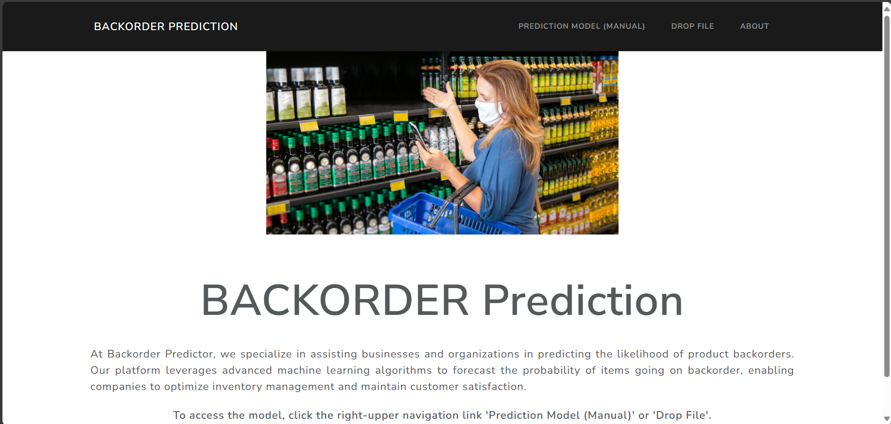
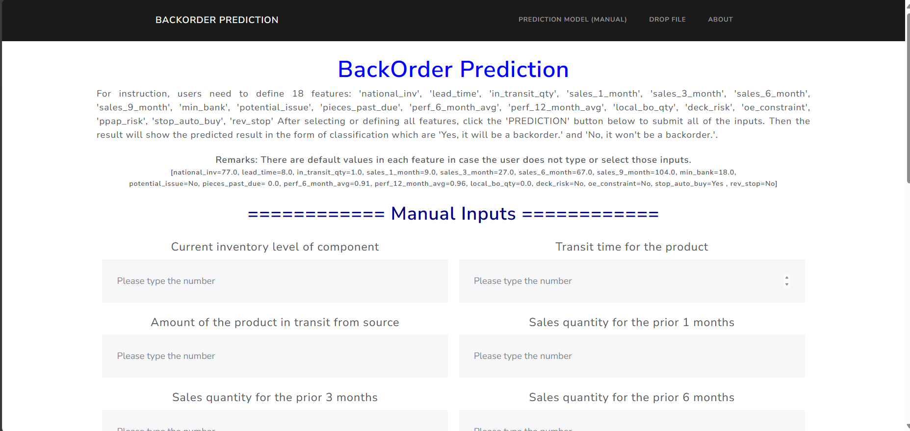
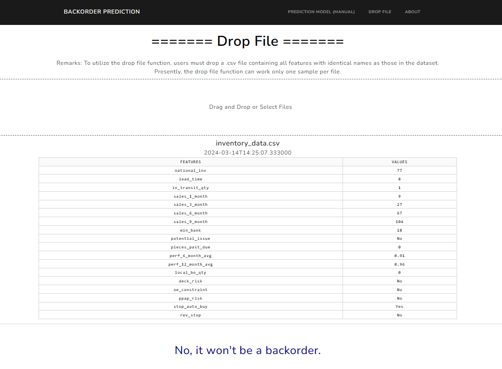

# Backorder Prediction System

This repository contains the implementation of a backorder prediction system, aimed at forecasting instances where products may become temporarily unavailable due to insufficient stock levels. The system leverages machine learning techniques to enhance inventory management and supply chain efficiency, ultimately improving customer satisfaction and business performance.

## Introduction

The backorder prediction system addresses the challenge of efficiently managing inventory to prevent stockouts while minimizing excess inventory costs. By accurately forecasting potential backorders, businesses can proactively manage their inventory levels, optimize supply chain processes, and mitigate the risk of understocking or overstocking.

## Methodology

### Exploratory Data Analysis (EDA)

The EDA phase involves analyzing the dataset, which comprises a mix of numerical and categorical features. Data cleaning and preprocessing techniques are applied to handle missing values, outliers, and class imbalances.

### Feature Selection

Features are selected based on their relevance to the prediction task, with redundant or non-predictive features removed from the dataset.

### Preprocessing

Data preprocessing involves standardization, scaling, and encoding of features to prepare them for machine learning model training.

### Machine Learning Training and Testing

Multiple machine learning algorithms are experimented with, and cross-validation techniques are employed to evaluate model performance. Hyperparameter tuning is conducted using GridSearchCV to optimize model parameters.

### Evaluation

Model performance is evaluated using various metrics, including accuracy, precision, recall, F1-score, and ROC-AUC score. Confusion matrices and ROC curves provide insights into the model's ability to correctly predict backorder instances.

## Conclusion

The backorder prediction system demonstrates promising results, particularly with the **Random Forest model** exhibiting high accuracy in identifying potential backorders. However, further optimization is needed to achieve a balance between precision and recall, ensuring robust performance across various inventory management scenarios.

## Future Work

Future work includes addressing class imbalance, performing feature selection techniques, exploring deep learning models, and leveraging feature engineering methods. These enhancements aim to further improve the predictive accuracy and reliability of the backorder prediction system.

## Web Application

The project also includes a web application built using Dash, allowing users to manually input or upload their Excel files the value for backorder prediction or manually input the value. Screenshots of the application will be provided in this space. 

Form for the manual input:

Uploaded the Excel files:

## License

This project is licensed under the [License Name] License - see the [LICENSE.md](LICENSE.md) file for details.
